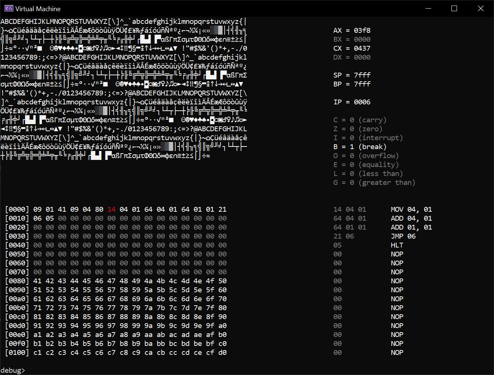

# Virtual Machine C++

A virtual machine / CPU emulator written in C++. It contains a VM, assembler, and debugger.



# CPU

The CPU contains four general purpose registers, named `AX`, `BX`, `CX`, and `DX`. There is a stack pointer `SP` which indicates the top of the stack. There is a base pointer `BP` which is the bottom of the stack. The stack grows upwards, to lower memory. Finally there is the instruction pointer `ip`.

|Name | Value | Bits | Description |
| -- | -- |-- | -- |
|`AX` | 1 | 16 | Register A | 
|`BX` | 2 | 16 | Register B | 
|`CX` | 4 | 16 | Register C | 
|`DX` | 8 | 16 | Register D | 
|`SP` | 16 | 16 | Stack pointer | 
|`BP` | 32 | 16 | Base pointer | 
|`IP` | 64 | 16 | Instruction pointer | 

The following flags are used in the virtual machine.

|Name | Value | Description |
| -- | -- | -- |
|`C` | 1  | Carry | 
|`Z` | 2  | Zero | 
|`I` | 4  | Interrupt | 
|`B` | 8  | Break | 
|`O` | 16  | Overflow | 
|`E` | 32  | Equal | 
|`L` | 64  | Less than | 
|`G` | 128  | Greater than | 


# Memory

Memory has the following layout:

| `0x00 - 0x1ffff` | `0x2000 + 0x24B0`  | `0x24B1 - sp` | `sp - 0x7FFF` | `0x8000 - 0xFFFF` |
| -- | -- | -- | -- | -- | -- |
| Empty | VGA | Empty | Stack | _Unused_ |

 * In the constructor of the virtual machine the amount of memory is currently set to 8kb.
 * The address range is `0x0000 - 0x8000`.
 * The VGA is mapped to address `0x2000` in memory. 
 * At the moment, a ROM is loaded at address `0x0000`.
 * The stack is located at the end of memory.

# Instructions

The virtual machine support the following opcodes.

| Mnemonic | Opcode | Bytes | Description | 
| -- | -- | -- | -- |
| `0x005` | `HLT` | 1 | Sets flag `B`, and halts |
| `0x009` | `MOV reg, const` | 3 | Move a `const` into `reg` |
| `0x010` | `MOV reg1, reg2` | 3 | Move the value of `reg2` into `reg1` |
| `0x011` | `MOV reg, mem` | 3 | Move the value of address `mem` into `reg` |
| `0x012` | `MOV mem, reg` | 3 | Move the value of `reg` into address `mem` |
| `0x013` | `MOV mem1, mem2` | 3 | Move the value of address `mem2` into address `mem1` |
| `0x020` | `TEST reg1, reg2` | 3 | Compare `reg1` to `reg2`, results are set as flags |
| `0x021` | `JMP addr` | 2 | Jump to `addr` |
| `0x022` | `JZ addr` | 2 | Jump to `addr` if `Z` is set |
| `0x023` | `JNZ addr` | 2 | Jump to `addr` if `Z` is not set |
| `0x024` | `JGT addr` | 2 | Jump to `addr` if `G` is set |
| `0x025` | `JLT addr` | 2 | Jump to `addr` if `L` is set |
| `0x026` | `JE addr` | 2 | Jump to `addr` if `E` is set |
| `0x027` | `JNE addr` | 2 | Jump to `addr` if `E` is not set |
| `0x40` | `PUSH reg` | 2 | Push the value of `reg` onto the stack. |
| `0x41` | `POP reg` | 2 | Pops the value from the stack into `reg` |
| `0x100` | `ADD reg, const` | 3 | Add the value of `const` to `reg` |
| `0x101` | `ADD reg1, reg2` | 3 | Add the value in `reg2` to `reg1` |

The opcodes are categorized into the following address ranges.

|Type | Range |
|--|--|
| General & Control Flow | `0x00 - 0x99` |
| Arithmetic | `0x100 - 0x140` |
| Bit operations | `0x140 - 0x180` |
| Other | `0x180 - 0x255` |

**Todo:** fix this weird schema with integer in hex values. Mapping goes from `0x00 - 0xff`.

# Assembly

Explain the Assembly language.

## CALL/RET

The opcodes `CALL` and `RET` call another function. These functions need to do some housekeeping.

```
my_function:

    ...

    RET

CALL my_function
```

Should be translated into:

```
my_function:
    ...
    POP ip


PUSH ip
JMP my_function
```

## Including files

Before assembling, other assembly files should be included. They are annotated with the `@include` directive.

```
%include("file.asm)
```

# Debugger

**Todo:** Explain the debugger.

# Todo

 * Write an assembler in Python.
   * Allow including of `asm` files with `%include("file.asm")`.
   * Implement labels for reference, defined with `label:`, and address is placed for `label`.
 * Generate better disassembler argument formatting.
 * Load a binary from a file.
 * Debugger command: load_rom, to load a binary into the VM.
 * Debugger command: reload, to reload the last load rom, for easier dev
 * Debugger command: reg = value, set the value of a register.
 * Debugger command: [mem] = value, set the value of a memory address.
 * Debugger breakpoints.
 * Expand the instruction set:
   * Arithmetic: `ADD`, `SUB`, `MUL`, `DIV`.
   * Logical operators: `AND`, `OR,` `NOT`, `XOR`, `SHL`, `SHR`.
   * Stack: `POP`, `PUSH`.
   * Functions: `CALL`, `RET`, but these can be rewritten in terms of `POP`, `PUSH`, and `JMP`.
 * Interrupts:
   * Keyboard input?
