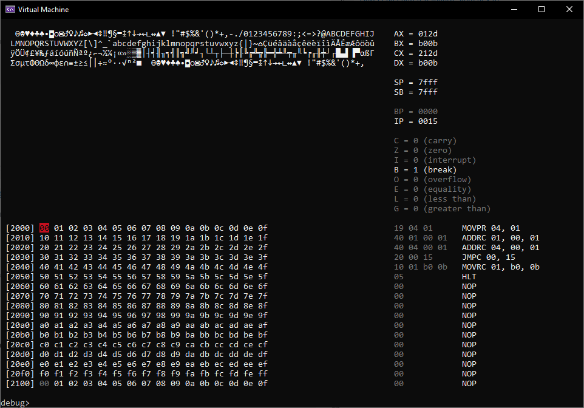

# Virtual Machine C++

A virtual machine / CPU emulator written in C++. It contains a VM, assembler, and debugger.



# CPU

The CPU contains four general purpose registers, named `AX`, `BX`, `CX`, and `DX`. There is a stack pointer `SP` which indicates the top of the stack. There is a base pointer `BP` which is the bottom of the stack. The stack grows upwards, to lower memory. Finally there is the instruction pointer `IP`.

|Name | Value | Bits | Description |
| -- | -- |-- | -- |
|`AX` | 1 | 16 | Register A | 
|`BX` | 2 | 16 | Register B | 
|`CX` | 4 | 16 | Register C | 
|`DX` | 8 | 16 | Register D | 
|`SP` | 16 | 16 | Stack pointer | 
|`SB` | 32 | 16 | Stack base | 
|`BP` | 64 | 16 | Base pointer (consider replacing with flags) | 
|`IP` | 128 | 16 | Instruction pointer | 

The following flags are used in the virtual machine.

|Name | Value | Description |
| -- | -- | -- |
|`C` | 1  | Carry | 
|`Z` | 2  | Zero | 
|`I` | 4  | Interrupt | 
|`B` | 8  | Break | 
|`O` | 16  | Overflow | 
|`E` | 32  | Equal | 
|`L` | 64  | Less than | 
|`G` | 128  | Greater than | 


# Memory

Memory has the following layout:

 * In the constructor of the virtual machine the amount of memory is currently set to 8kb.
 * The address range is `0x0000 - 0xffff`.
 * The VGA is mapped to address `0x2000` in memory. 
   * Size is set at `76x20` so `1520` bytes, range `0x2000-0x25f0`.
 * At the moment, a ROM is loaded at address `0x0000`.
 * The stack is located at the end of memory.

# Instructions

The [virtual machine support the following opcodes](opcodes.md).

## Including files

Before assembling, other assembly files should be included. They are annotated with the `@include` directive.

```
%include("file.asm)
```

# Debugger

 * Press `F5` to halt.
 * Enter `run` to start (shorthand: `r`).
 * Enter `reset` to reset.
 * Enter `step` to execute one instruction (shorthand: `s`).
 * Enter `exit` to exit.
 * Enter `mem addr` to change memory view (shorthand: `m`).
 * Enter `set_reg reg val` to set a register.
 * Enter `set_mem addr val` to set a memory address.
 * Enter `cursor addr` to set the write cursor at that address (shorthand: `c`).
 * Enter `assemble opcode arg1 arg2 (arg3)` to assemble those instruction and write them to the write cursor addres.
 * Enter `load file` to load a binary file at the write cursor.
 * Enter `reload` to reload the file at the write cursor.
 * Enter `b addr` to toggle a breakpoint (not added yet). 

# Todo

 * Write an assembler in Python.
   * Allow including of `asm` files with `%include("file.asm")`.
   * Implement labels for reference, defined with `label:`, and address is placed for `label`.
 * Generate better disassembler argument formatting.
 * Load a binary from a file.
 * Debugger command: load_rom, to load a binary into the VM.
 * Debugger command: reload, to reload the last load rom, for easier dev
 * Debugger command: reg = value, set the value of a register.
 * Debugger command: [mem] = value, set the value of a memory address.
 * Debugger breakpoints.
 * Expand the instruction set:
   * Arithmetic: `ADD`, `SUB`, `MUL`, `DIV`.
   * Logical operators: `AND`, `OR,` `NOT`, `XOR`, `SHL`, `SHR`.
   * Stack: `POP`, `PUSH`.
   * Functions: `CALL`, `RET`, but these can be rewritten in terms of `POP`, `PUSH`, and `JMP`.
 * Interrupts:
   * Keyboard input?
